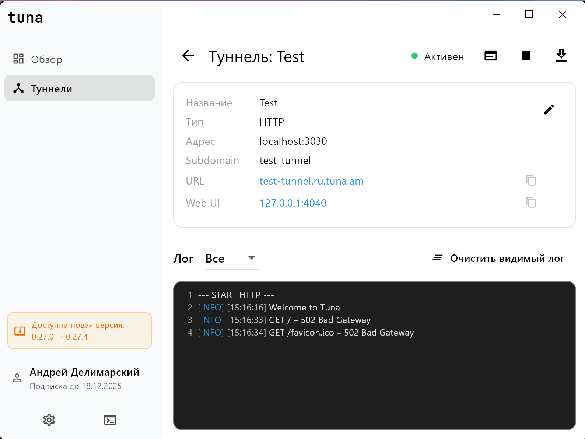

<p align="right">
  <a href="README.ru.md">🇷🇺 Read this in Russian</a>
</p>

<p align="center">
  
</p>

<p align="center">
  <a href="https://github.com/lekasnet/tuna-app/stargazers">
    
  </a>
  <a href="https://github.com/lekasnet/tuna-app/releases">
    
  </a>
  <a href="https://github.com/lekasnet/tuna-app/graphs/contributors">
    
  </a>
</p>

<p align="center">
  
  
</p>


# Before you begin

Tuna-app, also known as the Tuna Desktop Client, is an **unofficial utility** for working with the Tuna CLI created by the team behind [tuna.am](https://tuna.am/).

This project is **not** an attempt to misuse someone else’s product, but rather an effort to provide a more convenient interface for people who prefer not to work directly through the terminal or wish to optimize their workflow.

> To use Tuna Desktop Client, you must install the Tuna CLI from the  
> **[official website](https://tuna.am/docs/getting-started/?type=cli)**.

I am aware of the existence of the official Tuna Desktop client, but in my view, it does **not perform functions** beyond the absolute minimum.

**Thank you for your attention, [lek4s](https://github.com/LekasNet)**


# 🎛️ Tuna Desktop Client (Unofficial)

A graphical desktop client for the **Tuna Tunnel CLI**, built with Flutter.  
It allows you to manage tunnels, view logs, use a built-in console, and configure the CLI without relying on the terminal.



> ⚠️ **Important!**  
> The **Linux** and **macOS** versions are implemented, but **have not been tested on actual devices**.  
> Theoretically they should work, but their correctness is not guaranteed.

---

## 📦 Download (Windows)

👉 The latest stable **Windows** build is available in the GitHub  
**[Releases](https://github.com/lekasnet/tuna-app/releases)** section.

---

## 🧰 Building for Linux / macOS

Prebuilt binaries for Linux and macOS are **NOT included**.  
To obtain these versions, you must **build the project yourself**:

### Enable Desktop Targets

```sh
flutter config --enable-linux-desktop
flutter config --enable-macos-desktop
````

### Build

```sh
flutter build linux
flutter build macos
```

Build outputs:

* Linux → `build/linux/x64/release/`
* macOS → `build/macos/Build/Products/Release/Tuna.app`

---

## 🚀 Features

* Management of HTTP and TCP tunnels
* Real-time tunnel status display
* Detailed tunnel information: URL, Web UI, forwarding, logs
* Integrated console:

  * custom command interpreter
  * PowerShell / bash mode (depending on platform)
  * colored output, auto-scrolling, line numbers
  * command history with ↑ ↓
* Full support for light and dark themes
* Custom path support for the `tuna` CLI
* Automatic detection of `tuna.exe` / `tuna`
* Token, API key, and account data storage
* Copy buttons for URL / Web UI / forwarding
* Export logs to file
* Custom title bar with custom window buttons
* Rounded corners and modern Flutter 3.x UI

---

## ⚙️ Requirements

* Flutter SDK 3.19+
* Tuna CLI (`tuna`, `tuna.exe`) installed in PATH
  or configured manually in the client settings
* Windows 10+ / Linux x64 / macOS 12+ (Intel or ARM)

---

## 💾 Settings

The application automatically saves:

* theme
* token
* API key
* tuna executable path
* username and subscription expiration date
  (after the first successful tunnel launch)

When the token changes, the app automatically:

* updates the `tuna.yml` configuration
* validates the token via a temporary tunnel (`tuna http 8080`)
* synchronizes the account information

---

## 🧑‍💻 Development

### Clone

```sh
git clone https://github.com/lekasnet/tuna-app.git
cd tuna-app
flutter pub get
```

### Run

```sh
flutter run -d windows
# or
flutter run -d linux
# or
flutter run -d macos
```

---

## 📄 License

MIT — feel free to use and modify.