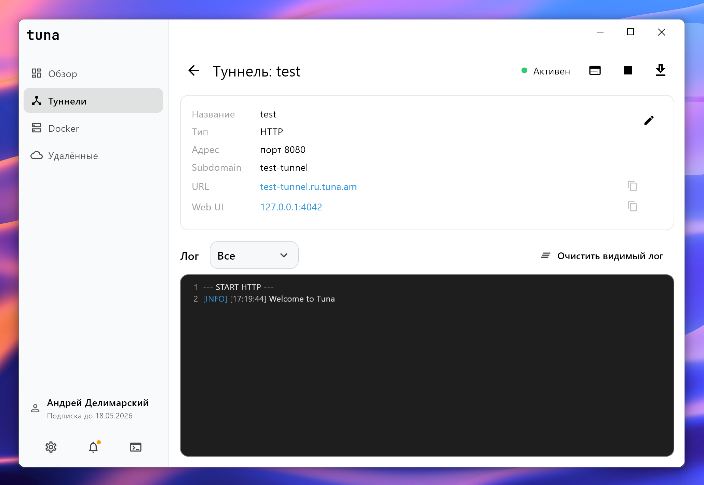
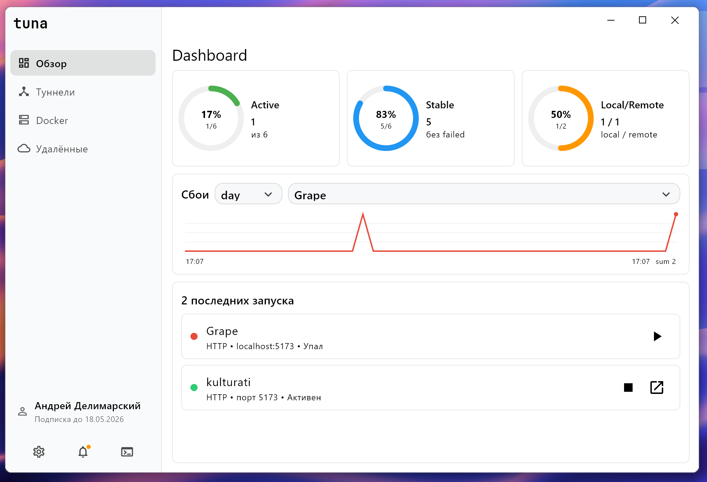
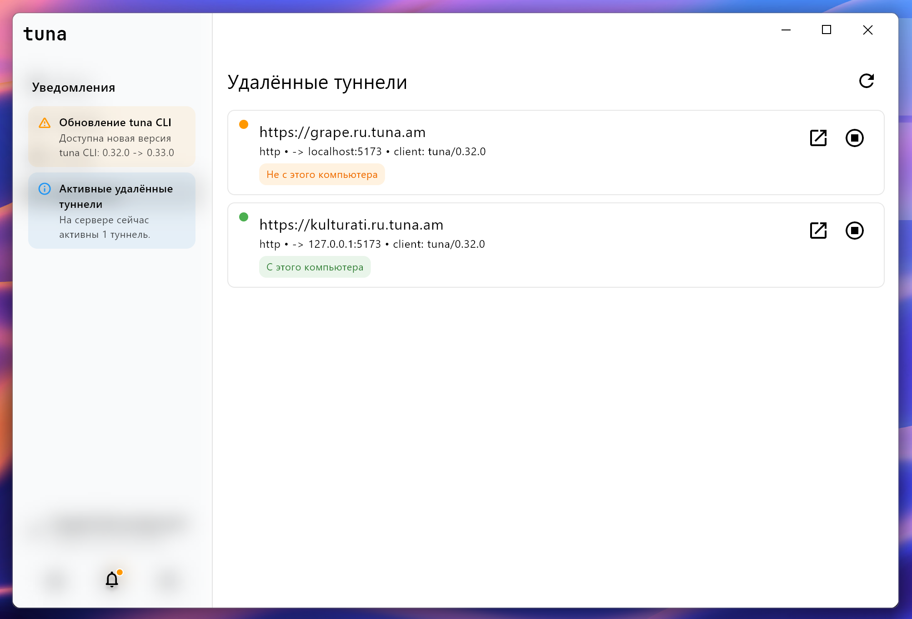
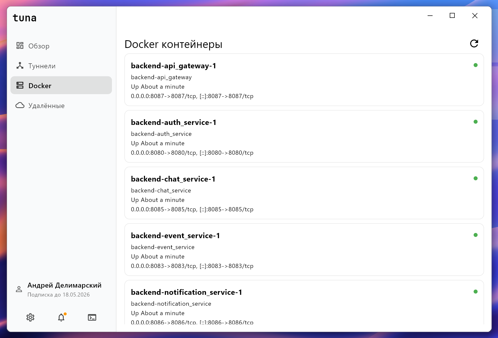
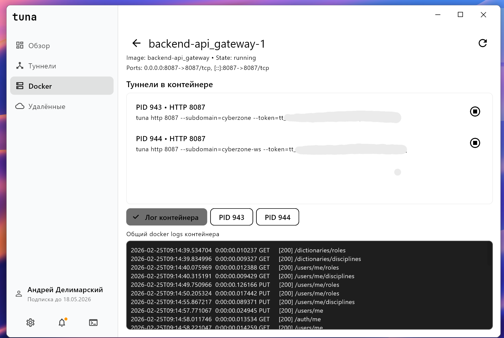

<p align="right">
  <a href="README.md">🇬🇧 Read this in English</a>
</p>

<p align="center">
  
</p>

# Перед ознакомлением

Tuna-app, а иначе Tuna desktop client - неофициальная утилита для работы с tuna CLI, разработанной командой [tuna.am](https://tuna.am/)

Это не попытка использования чужого труда в своих целях, а лишь предоставление удобного интерфейса для тех, кто не любит работать через консоль, или хочет оптимизировать своё рабочее пространство.

> Для работы Tuna desktop client необходимо установить Tuna CLI с [официального сайта](https://tuna.am/docs/getting-started/?type=cli)

Я знаю о существовании официального клиента tuna desktop, но на мой взгляд он **не выполняет функций** свыше минимума.

**Спасибо за вимание, [lek4s](https://github.com/LekasNet)**


# 🎛️ Tuna Desktop Client (Unofficial)

Графический десктоп-клиент для **Tuna Tunnel CLI**, разработанный на Flutter.  
Позволяет управлять туннелями, просматривать логи, работать с локальной встроенной консолью и настраивать CLI без прямой работы в терминале.



### Новые модули

| Dashboard | Удалённые туннели и уведомления |
| --- | --- |
|  |  |

| Docker контейнеры | Детали Docker контейнера |
| --- | --- |
|  |  |

> ⚠️ **Важно!**  
> Версии для **Linux** и **macOS** были реализованы, но **не тестировались на реальных устройствах**.  
> Теоретически они должны работать, однако их корректность не гарантируется.

---

## 📦 Скачать (Windows)

👉 Последний стабильный билд для **Windows** доступен в разделе [Releases](https://github.com/lekasnet/tuna-app/releases) GitHub

---

## 🧰 Сборка Linux / macOS

Готовые бинарники **НЕ** прилагаются.  
Чтобы получить версии для Linux или macOS, вам необходимо **собрать проект самостоятельно**:

### Enable Desktop Targets

```sh
flutter config --enable-linux-desktop
flutter config --enable-macos-desktop
````

### Build

```sh
flutter build linux
flutter build macos
```

Результаты сборки:

* Linux → `build/linux/x64/release/`
* macOS → `build/macos/Build/Products/Release/Tuna.app`

---

## 🚀 Возможности

* Управление туннелями HTTP и TCP
* Вкладка Dashboard с кольцевыми метриками, графиком сбоев (включая режим `All`) и двумя последними запусками
* Вкладка удалённых туннелей: список активных туннелей из Tuna API, маркер «с этого/не с этого компьютера» по URL назначения, открытие и принудительная остановка
* Вкладка Docker: список контейнеров, переход в детали контейнера, поиск tuna-процессов внутри, логи контейнера/туннеля, принудительная остановка туннелей в контейнере
* Панель уведомлений с кликабельными действиями (обновление CLI, релизы desktop-приложения, активные удалённые туннели)
* Обновление tuna CLI прямо из приложения:

    * Windows: `winget upgrade --id yuccastream.tuna`
    * macOS: `brew upgrade tuna`
    * Linux: `sh -c "$(curl -sSLf https://releases.tuna.am/tuna/get.sh)"`
* Проверка обновления desktop-приложения через GitHub Releases (`LekasNet/tuna-app`)
* Сверка активных туннелей при запуске (локальные процессы + удалённое активное количество)
* Просмотр статуса туннелей в реальном времени
* Детальная карточка туннеля: URL, Web UI, forwarding, логи
* Встроенная консоль:

    * собственный интерпретатор команд
    * режим PowerShell / bash (в зависимости от платформы)
    * подсветка вывода, автоскролл, нумерация строк
    * история команд ↑ ↓
* Защита производительности логов: в UI отображаются только последние 750 строк, при этом полный лог сохраняется для экспорта
* Полная поддержка темной и светлой темы
* Поддержка кастомного пути до `tuna` CLI
* Автоопределение местоположения `tuna.exe` / `tuna`
* Поддержка хранения токена, API-ключа и данных аккаунта
* Поддержка копирования URL, Web UI, forwarding ссылок
* Экспорт логов в файл
* Системное окно с кастомными кнопками (без стандартной рамки)
* Скругленные углы и современный UI на Flutter 3.x

---

## ⚙️ Требования

* Flutter SDK 3.19+
* Tuna CLI (`tuna`, `tuna.exe`) установлен в PATH
  или указанный путь в настройках клиента
* Windows 10+ / Linux x64 / macOS 12+ (Intel или ARM)

---

## 💾 Настройки

Настройки автоматически сохраняются:

* тема
* токен
* API-ключ
* путь до `tuna`
* имя пользователя и дата истечения подписки (после первого запуска туннеля)

При изменении токена приложение автоматически:

* обновляет конфиг `tuna.yml`
* валидирует его через `tuna http 8080`
* синхронизирует данные аккаунта

---

## 🧑‍💻 Разработка

### Клонирование

```sh
git clone https://github.com/lekasnet/tuna-app.git
cd tuna-app
flutter pub get
```

### Запуск

```sh
flutter run -d windows
# или
flutter run -d linux
# или
flutter run -d macos
```

---

## 📄 Лицензия

MIT — свободно используйте и изменяйте.
